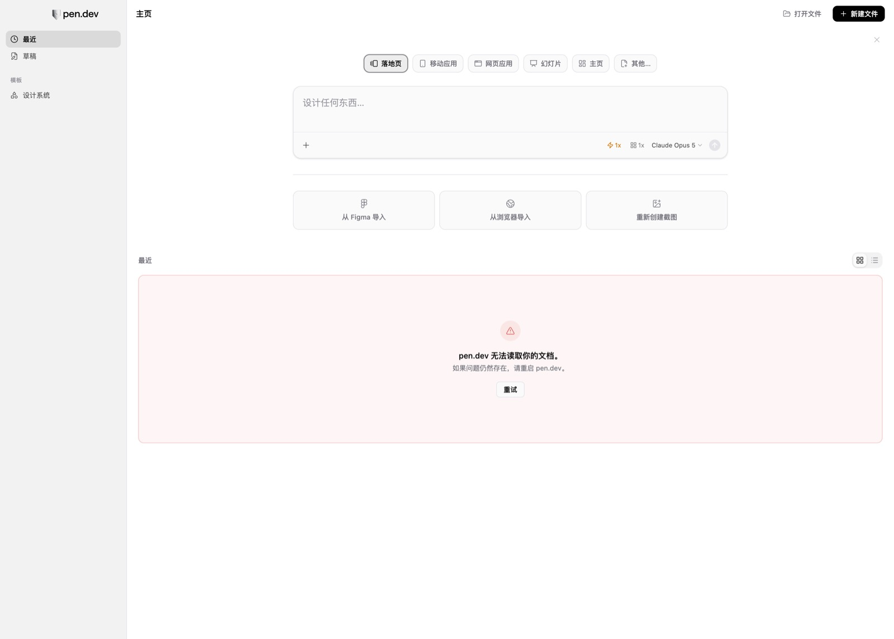
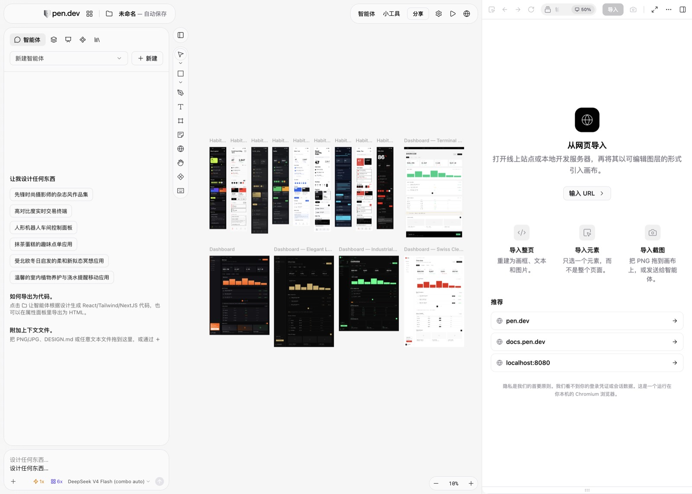

# zh-patch

**给 Electron 应用做运行时中文化 —— 不修改 App 本体、可一键撤回，并且对 AI Agent 友好。**

已经被用来把 [Pen (pencil.dev)](https://pen.dev) 完整汉化（1800+ 条词典，含 macOS 原生菜单栏），仓库里直接带这份现成词典。

```bash
git clone https://github.com/wh000wh000/zh-patch.git
cd zh-patch
npm link                      # 可选：把它变成全局 `zh-patch` 命令（不用 npm 就写 node bin/zh-patch.mjs）

mkdir -p ~/pen-zh && cd ~/pen-zh
zh-patch preset use pen       # 套用 Pen 预设：配置 + 1800+ 条词典
zh-patch start                # 带汉化启动 Pen（Ctrl+C 退出；也可 --daemon 常驻）
zh-patch verify               # 看汉化覆盖率，例如 98.8%
```

> English: `zh-patch` injects a Chinese localization layer into any Electron app at runtime via the DevTools Protocol (no `app.asar` patching, no code-signature breakage, instantly reversible), and exposes an agent-friendly CLI (`--json` everywhere, `extract` / `todo` / `verify` loop) so an AI agent can localize an app end-to-end. A ready-to-use Pen (pencil.dev) dictionary with 1800+ entries is bundled.

---

## 效果（Pen 实测）

| 主页 | 编辑器 / 智能体面板 |
|---|---|
|  |  |

界面文案、输入框占位符、动态计时（`思考了 44s`）、错误提示（`pen.dev 无法读取你的文档。`）都是中文；模型名、模板名等内容保持英文。

## 为什么不用「改 app.asar」那套

| 方案 | 问题 |
|---|---|
| 解包/改写 `app.asar` | 破坏 `ElectronAsarIntegrity` 校验与代码签名，App 可能直接起不来；每次更新失效 |
| 解包成 `Resources/app/` 目录 | 同上，且 `app.asar.unpacked` 路径逻辑会错乱 |
| 系统级 App 汉化工具 | 只能读不能改，覆盖不全 |
| **zh-patch（运行时注入）** | 只碰内存里的 DOM 与主进程菜单对象；App 文件一个字节没动，随时撤回，更新后照样能用 |

## 它怎么工作

```
zh-patch start
   ├─ 带 --remote-debugging-port / --inspect 启动 App（不是改 App）
   ├─ 连渲染进程（CDP）→ 注入「DOM 翻译层」
   │     精确匹配替换 text / placeholder / title / aria-label / alt
   │     MutationObserver 跟进动态渲染；重载、新窗口自动重注入
   └─ 连主进程（Node inspector）→ 改写原生菜单的 label
```

细节见 [docs/HOW-IT-WORKS.md](docs/HOW-IT-WORKS.md)。

## 命令一览

| 命令 | 作用 |
|---|---|
| `preset use pen` | 套用内置预设（配置 + 1800+ 条词典） |
| `init --app /Applications/X.app` | 给任意 Electron App 生成配置与空词典 |
| `doctor` | 自检：Node / 配置 / App / 端口 / 词典 |
| `start [--daemon] [--restart]` | 带汉化启动（默认前台守护，`--daemon` 后台） |
| `apply` | 对已开启调试端口的 App 做一次性注入 |
| `status` | App、端口、注入状态、覆盖率 |
| `extract` | 抓取当前界面所有可见 UI 字符串 |
| `todo` | **列出未收录的可见文案**（Agent 的工作清单） |
| `verify --min 90` | **输出覆盖率**，低于阈值退出码 1 |
| `menu [--read]` | 汉化原生菜单 / 读取当前菜单树 |
| `dict stats\|add\|merge\|check` | 词典维护 |
| `brand --enable --url https://你的站点` | 开启**汉化署名角标**（默认关闭，明确标注来源） |
| `install-launcher` | 生成双击启动脚本 |
| `manifest --json` | 机器可读的命令与契约清单 |
| `stop [--restart]` | 停止注入；`--restart` 恢复原版启动 |

所有命令都支持 `--json`（stdout 只吐 JSON），方便脚本和 Agent 解析。

## 给 AI Agent 的闭环

```bash
zh-patch doctor --json                  # 1. 确认可注入
zh-patch start --daemon --json          # 2. 拉起 App + 守护
zh-patch extract --json                 # 3. 抓当前界面所有 UI 串
zh-patch todo --json --write todo.json  # 4. 取未翻译清单
#    5. Agent 翻译 todo.json → translation.json（原样保留 key / 占位符 / 快捷键）
zh-patch dict merge translation.json    # 6. 合并（守护 2.5s 内自动重刷）
zh-patch verify --json --min 90         # 7. 验收；不达标退出码 1，回去继续 5
zh-patch stop --restart                 # 8. 收尾
```

契约、退出码、翻译规范见 [AGENTS.md](AGENTS.md) 与 [docs/TRANSLATING.md](docs/TRANSLATING.md)。

## 覆盖范围（Pen 实测）

| 区域 | 状态 |
|---|---|
| 主页 / 编辑器工具栏 / 属性面板 / 智能体面板 / 模型选择器 | ✅ |
| 输入框占位符（含 tiptap/ProseMirror 的伪元素占位符） | ✅ |
| 动态文案（`Thought for 44s` → `思考了 44s`） | ✅ |
| macOS 原生菜单栏（含 Electron 内置 role 项） | ✅ 80 个 label |
| 右键菜单 / 系统文件对话框 | ⚠️ 由系统或构建期决定，部分或无法覆盖 |
| 画在 canvas 里的文字、智能体回复正文、用户输入 | ❌ 有意不动 |

## 汉化署名（attribution）

免费工具留个署名是常规做法，本项目的做法是**明确标注来源**、默认关闭、用户可点 × 永久隐藏：

```bash
zh-patch brand --enable --url https://example.com --text "中文汉化：example.com"
zh-patch brand --disable        # 关掉
zh-patch brand show             # 看当前设置
```

或者直接写进 `zh-patch.config.json`：

```json
{
  "branding": {
    "enabled": true,
    "text": "中文汉化：example.com",
    "link": "https://example.com",
    "corner": "bottom-center",
    "opacity": 0.5,
    "dismissible": true
  }
}
```

角标渲染在窗口角落（默认底部居中），半透明、悬停变亮、不遮挡操作。它会同时出现在 `zh-patch status` / `start` 的输出里。

> 注意：角标写的是「汉化由谁提供」，**不会伪装成宿主 App 自带的界面元素**。请不要把它改成未经标注的商业广告 —— 那会误导用户、冒用第三方产品背书，也容易让项目被投诉下架。

## 已知边界

- 目标 App 必须**由 zh-patch 启动**（要开调试端口）。直接点 Dock 图标启动的是原版。
- 调试端口只监听 `127.0.0.1`，但本机其他程序可以连；不要在不可信环境长期挂着。
- 注入层只做文本替换，不 hook API、不拦截网络、不改持久化数据。

## 给别的 App 做汉化

```bash
zh-patch init --app "/Applications/YourApp.app"
zh-patch start                  # 启动并注入（此时词典是空的，界面没变化）
zh-patch extract                # 把界面上所有可见英文抓下来
zh-patch todo --write todo.json # 得到工作清单
# 翻译 → zh-patch dict merge translation.json → 保存即生效（不用重启）
zh-patch install-launcher       # 给普通用户一个双击入口
```

换其它 App 的词典格式完全一样：`{"英文原文": "中文译文"}`。

## 参与

- 新增一份 App 词典：放 `dict/`，再提交一个 `presets/<app>.json` 与 PR。
- 报告某条没翻到：贴 `zh-patch todo --json` 的输出。
- 翻译规范见 [docs/TRANSLATING.md](docs/TRANSLATING.md)。

## 关于

- 项目维护：[cc8.cc](https://www.cc8.cc)
- 内置 Pen 词典是实际使用中逐条攒出来的（1880 条），欢迎补漏。

## License

MIT