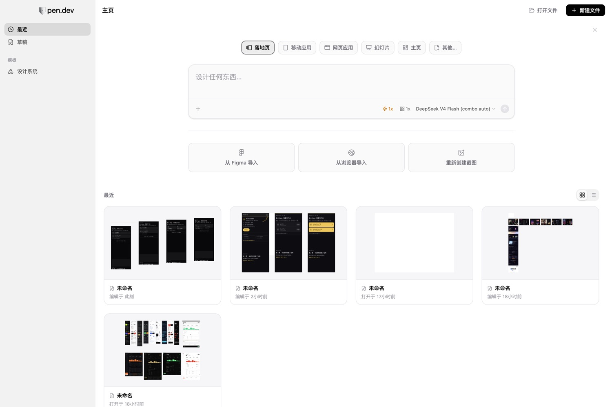
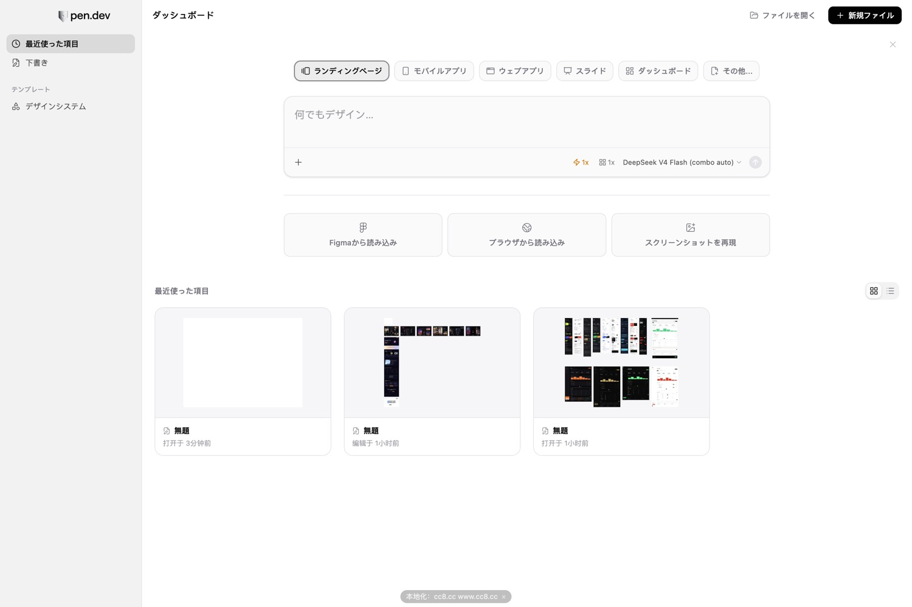
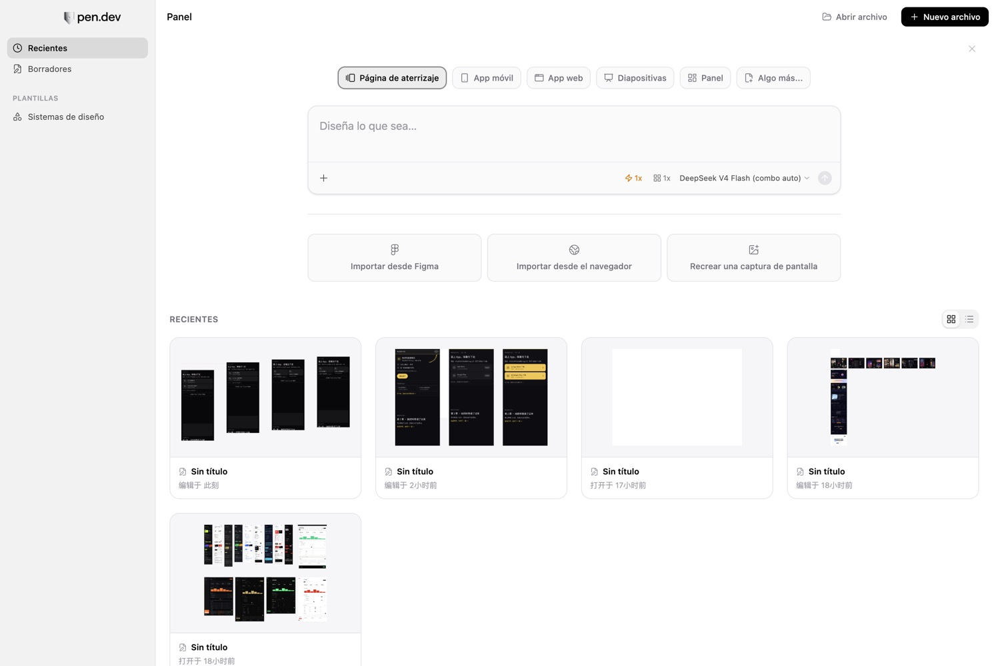
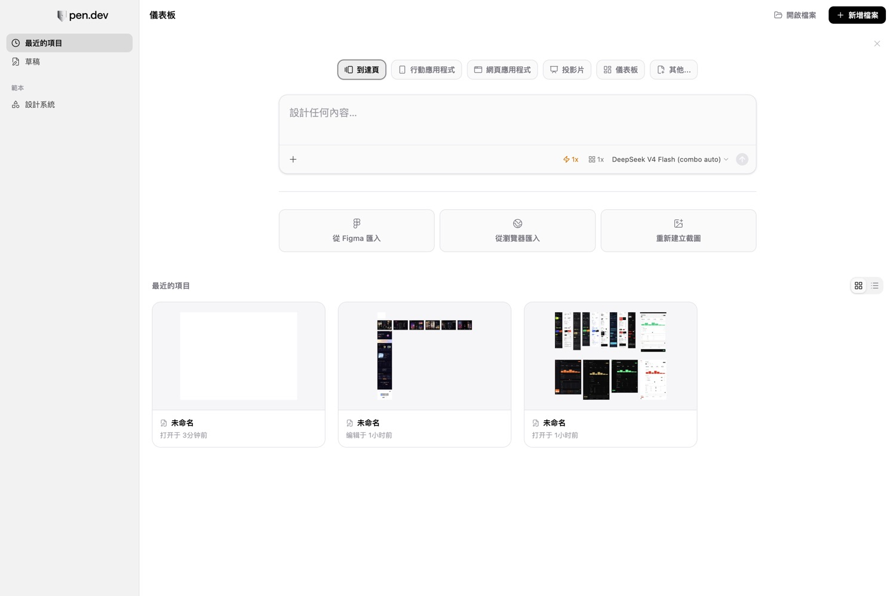

# Pen (pencil.dev) 汉化补丁 · 中文 & 12 语言

> **Pen 没有中文界面？我们把它汉化好了 —— 装上就有。界面、原生菜单栏、输入框提示、报错全部中文，也可以一键切成日本語 / 한국어 / Español 等 12 种语言。**

[](#支持的语言)
[](#安装)
[](#%E4%BC%9A%E4%B8%8D%E4%BC%9A%E6%94%B9%E6%88%91%E7%9A%84-pen)
[](LICENSE)



## 安装

**macOS**，需要先装 [Node.js 20+](https://nodejs.org)（`node -v` 能打印版本即可）。

```bash
git clone https://github.com/wh000wh000/pen-dev-i18n.git
cd pen-dev-i18n
./install.sh
```

脚本会在你的主目录建好 `~/Pen汉化/`（配置 + 12 语言词典 + 双击启动器）。

**以后只要双击 `~/Pen汉化/启动 Pen 汉化.command`** —— 它会带汉化启动 Pen。第一次如果提示「Pen 正在运行」，先按 `Cmd+Q` 退出再双击。

<details>
<summary>手动三步（不想跑脚本的话）</summary>

```bash
git clone https://github.com/wh000wh000/pen-dev-i18n.git && cd pen-dev-i18n
mkdir -p ~/Pen汉化 && cd ~/Pen汉化
node <上面的仓库路径>/bin/zh-patch.mjs preset use pen   # 装好配置与词典
node <上面的仓库路径>/bin/zh-patch.mjs start            # 启动并汉化（Ctrl+C 退出）
```
</details>

## 它会变成什么样

| 简体中文 | 日本語 |
|---|---|
|  |  |

| Español | 繁體中文 |
|---|---|
|  |  |

- **界面文案**：主页、模板卡、编辑器工具栏、属性面板、智能体面板、模型选择器、错误提示 —— 全中文
- **macOS 菜单栏**：`文件 / 编辑 / 视图 / 窗口 / 帮助`，连「退出 Pen」「隐藏其他」「全选」这些系统项也一起汉化
- **输入框与悬停提示**：包括编辑器里那类用 CSS 画的占位符
- **动态文案**：`Thought for 44s` → `思考了 44s`，`Edited 8分钟前` → `编辑于 8分钟前`

**保持原样的是**：模型名（`Claude Opus 5`、`DeepSeek V4 Flash`）、模板名、字体名，以及你自己的设计和对话内容 —— 这些是内容，不是界面。

## 支持的语言

| | | | |
|---|---|---|---|
| 简体中文 `zh-CN` | 繁體中文 `zh-TW` | 日本語 `ja` | 한국어 `ko` |
| Español `es` | Français `fr` | Deutsch `de` | Português `pt-BR` |
| Русский `ru` | Italiano `it` | Tiếng Việt `vi` | Türkçe `tr` |

切换语言（**不用重启 Pen，也不用刷新窗口**，两秒后界面就变）：

```bash
cd ~/Pen汉化
node /path/to/pen-dev-i18n/bin/zh-patch.mjs lang use ja    # 日本語
node /path/to/pen-dev-i18n/bin/zh-patch.mjs lang use zh-CN # 切回中文
```

> 简体中文是逐条校对的母本；其余 11 种是 AI 初翻，日常使用没问题，**欢迎母语者提 PR 修正**。

## 常见问题

<details>
<summary><b>会不会改我的 Pen？</b></summary>

不会。补丁**不修改 Pen 的任何文件**（不动 `app.asar`、不改代码签名），只是在 Pen 运行时替换它界面里的文字。关掉之后 Pen 和原版一模一样 —— 这也是它和「汉化版安装包」最大的区别：你不会因为装了汉化而失去官方更新。
</details>

<details>
<summary><b>Pen 更新到新版本后还有效吗？</b></summary>

有效。因为没改安装包，更新不会被破坏。新版本里新增的英文文案若还没被覆盖，用下面「反馈」的方法告诉我们即可。
</details>

<details>
<summary><b>安全吗？会不会影响账号？</b></summary>

- 补丁**不联网、不碰登录态、不改你的设计文件和历史记录**，只在本地内存里替换界面文字。
- 为了让补丁能注入，Pen 需要以「调试端口」方式启动 —— 这也正是不用改安装包的原因。该端口只监听本机 `127.0.0.1`。
- 想彻底停：`Cmd+Q` 退出 Pen，再正常打开就是原版。
</details>

<details>
<summary><b>怎么关掉 / 卸载？</b></summary>

- 临时关掉：退出 Pen，直接从 Dock/启动台打开 Pen（不经启动器）＝ 原版英文
- 彻底卸载：删掉 `~/Pen汉化/` 与克隆下来的仓库目录即可，Pen 不受影响
- 只想停掉后台守护：`node <repo>/bin/zh-patch.mjs stop`
</details>

<details>
<summary><b>有些地方还是英文？</b></summary>

已知无法覆盖的：

- 画布上直接绘制出来的文字（例如画框角上的 `Frame`）—— 它画在 canvas 里，不在界面层
- macOS 的系统文件对话框（打开/保存）
- 新版本新增的、词典里还没有的文案

前两类没办法；第三类请[提 issue](../../issues)，附上截图和你在 `~/Pen汉化` 下运行 `node <repo>/bin/zh-patch.mjs todo --json` 的输出，我们补进词典。
</details>

<details>
<summary><b>它会拖慢 Pen 吗？</b></summary>

不会。翻译层只在界面新增/变化文字时做一次精确匹配替换；词典是纯查表，没有正则扫描、没有网络请求。
</details>

---

# 给开发者 / 想自己扩展

下面这部分是补丁背后的工具（`zh-patch`）。它一开始就是为 Pen 写的，但结构上通用：**任何 Electron 应用 + 任意语言的词典**都能用同一套机制。

## 它怎么做到不改安装包

```
启动器 → 带调试端口启动 Pen
   ├─ 连渲染进程（DevTools 协议）→ 注入「翻译层」：精确匹配替换文本 / placeholder / title / aria-label，
   │   MutationObserver 跟进动态渲染；页面重载、新窗口自动重注入
   └─ 连主进程（Node inspector）→ 改写原生菜单的 label
```

为什么不用「改 `app.asar`」那套：macOS 上 `Info.plist` 里有 `ElectronAsarIntegrity` 的 SHA256 校验，改了就必须同步改 plist，而 plist 属于代码签名封印的一部分 —— 实测在带 hardened runtime 的 Pen 上重签名会直接失败、App 起不来。运行时注入则是进程退出即恢复。细节见 [docs/HOW-IT-WORKS.md](docs/HOW-IT-WORKS.md)。

## 命令

| 命令 | 作用 |
|---|---|
| `preset use pen` | 装好 Pen 的配置与词典（12 语言） |
| `start` / `stop` | 带本地化启动 / 停用（`--daemon` 常驻后台） |
| `lang list\|use <代码>` | 列出 / 切换到指定语言（热切换） |
| `imagegen [enable\|disable\|test]` | 生图旁路：把宿主的出图请求转发到你的 OpenAI 兼容服务 |
| `status` / `verify` | 运行状态与**本地化覆盖率** |
| `todo` / `extract` | 列出还没翻译的界面文案 / 抓取当前界面全部文案 |
| `dict add\|merge\|check` | 词典维护 |
| `init --app <路径>` | 给**其它 Electron 应用**建一份配置 |
| `install-launcher` | 生成双击启动脚本 |
| `manifest --json` | 机器可读的命令清单（给 AI Agent 用） |

所有命令都支持 `--json`（stdout 只吐 JSON）；退出码语义见 [AGENTS.md](AGENTS.md)。

## 进阶：把 App 的托管出图换成你自己的模型（生图旁路）

有些设计工具（例如 Pen）的出图不是在本地调 API，而是把请求发回它自己的后端：

```js
POST https://api.pencil.dev/generate-image     // 由它计费
{ prompt, imageGeneratorProvider }             // 只有 nano_banana / nano_banana_lite / openai 三个值
```

设置里那个 `Default image generation provider` 只决定**它后端**用哪个模型，接不了你自己的服务。`zh-patch` 可以在这条链路上做**旁路**：界面、按钮、provider 下拉全都不动，只把出图的字节换成你自己模型产出的。

```bash
# ~/Pen汉化/zh-patch.config.json
"imagegen": {
  "enabled": true,
  "match": "api.pencil.dev/generate-image",
  "baseUrl": "http://127.0.0.1:<你的端口>/v1",  // 你的 OpenAI 兼容出图服务
  "apiKey": "…",
  "model": "gpt-5.5",                          // combo 路由的宿主模型
  "toolModel": "gpt-image-2.5-sunburst",       // 真正出图的工具模型
  "providerMap": { "openai": "gpt-image-2.5-sunburst", "nano_banana_lite": "gpt-image-2.5-flare" },
  "size": "1024x1024", "quality": "high"
}

./pen-zh imagegen test      # 先自检：确认能出图
./pen-zh stop && ./pen-zh start --daemon   # 重启守护让旁路生效
```

之后在 Pen 里正常点「生成图片」/ 让 agent 出图，实际出图的就是你配的模型。

**它是怎么绕过去的**（值得一看，因为限制挺多）：

1. 宿主的请求是**渲染进程**用 `fetch` 发的，而渲染进程的 CSP `connect-src` 不允许直连本机任意端口 —— 直接改 URL 会被 CSP 拦掉；
2. 但白名单里有 `http://api.localhost:3001`。于是转发器绑在 **`[::1]:3001`**（IPv6 回环；`localhost:3001` 那半个白名单常被别的应用占着 IPv4），页面里的请求 URL 改写到它；
3. 页面 origin 是 `pencil://editor`，属于跨源，所以转发器还要回 CORS 头（含 `OPTIONS` 预检）；
4. 转发器把吐回来的 `b64_json` 包装成宿主期望的 `{ success: true, image: "<纯 base64>" }`，宿主照旧解码、导入文档。

前提：`imagegen` 需要**守护进程常驻**（`start --daemon`），一次性 `apply` 不行。旁路失败时会自动回落到官方后端（`fallbackToOriginal`）。

## 给别的 App 做本地化

```bash
zh-patch init --app "/Applications/YourApp.app"
zh-patch start --daemon
zh-patch todo --write todo.json       # 收集未翻译的界面文案
#   翻译 todo.json → translation.json（key 原样保留）
zh-patch dict merge translation.json  # 合并，2.5 秒内界面即生效
zh-patch verify --min 90              # 验收覆盖率
```

## 给 AI Agent 的闭环

```bash
zh-patch doctor --json                 # 自检
zh-patch start --daemon --json         # 启动 + 守护
zh-patch todo --json --write todo.json # 工作清单
zh-patch dict merge translation.json   # 合并译文
zh-patch verify --json --min 90        # 覆盖率，未达标退出码 1
```

契约、故障处置、词典规范都在 [AGENTS.md](AGENTS.md)；翻译规范与术语表在 [docs/TRANSLATING.md](docs/TRANSLATING.md)；多语言与新增语言的流程在 [docs/LANGUAGES.md](docs/LANGUAGES.md)。

## 参与

- **报漏译 / 纠错**：[提 issue](../../issues)（附截图 + `todo --json` 输出最有效）
- **校对语言**：直接改 `dict/pen.<语言>.json` 提 PR，`zh-CN` 之外的 11 种都欢迎
- **新增语言**：见 [docs/LANGUAGES.md](docs/LANGUAGES.md)
- 项目是怎么被搜到的、还能怎么做推广：[docs/PROMOTION.md](docs/PROMOTION.md)

## 关于

- 本项目是**社区作品**，与 pen.dev / pencil.dev 官方无关；相关商标与版权归其各自所有者。
- 内置简体中文词典是实际使用中逐条攒出来的（1880 条）。若官方日后推出官方中文，这个补丁可以随之退役 —— 那是最好的结局。

## License

MIT
